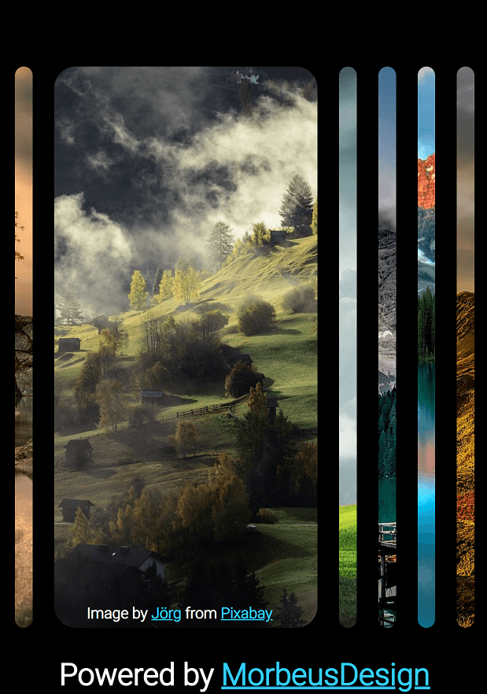

# Responsive Photos Slider

## A simple Photos Slider component made by standard Html/Css & Javascript

 

### Desktop Screenshot #1

### Desktop Screenshot #2

---
### Tablet Screenshot #1

### Tablet Screenshot #2

---
### Mobile Screenshot #1

### Mobile Screenshot #2

